# HexHawk for Dummies

A Practical Buyer and Operator Guide to Binary Intelligence, Reverse Engineering, Evidence Workflows, Configuration, Plugins, Reports, and Advanced Jobs

Last updated: 2026-07-14
Audience: first-time technical buyers, internal testers, security operators, malware analysts, incident responders, and analysts learning HexHawk.

## HexHawk 1.0.0 milestone update

HexHawk now saves versioned projects and reliably reopens them after process restart or cache clearing. A project verifies the imported binary's identity and persistently links optional advisory NEST lifecycle context to the immutable recorded GYRE verdict snapshot. Missing, malformed, unsupported, stale, mismatched, and cross-binary authority data are rejected. Reports and exports carry recorded-snapshot provenance and fall back honestly to summary-only output when authoritative evidence is unavailable.

GYRE is the sole classification and recorded base-verdict authority. NEST does not independently classify or override GYRE. AETHERFRAME/Forge is optional, bounded, replayable, auditable, disableable, and non-authoritative; NEXUS is an assistant and cannot mutate authoritative state.

The Windows 1.0.0 MSI and NSIS release-candidate installers were built and hash/metadata verified. Both are Authenticode `NotSigned`. Controlled installation, installed launch, installed persistence/restart/provenance, uninstall, and reinstall acceptance remain unpassed. See [`CURRENT_STATUS.md`](CURRENT_STATUS.md) and [`TESTER_RELEASE_STATUS.md`](TESTER_RELEASE_STATUS.md) before testing.


## Is this guide comprehensive?

Yes for the current product story and tester workflow: it covers what HexHawk is, who should use it, what goes in, what comes out, how the main modules fit together, how to operate safely, how to export reports, how to verify release artifacts, and what claims remain gated.

Comprehensive does not mean finished forever. Treat this guide as the public-facing acceptance checklist for each release:

- If a buyer asks “what do I upload or open?”, point them to **Input** sections.
- If a tester asks “what button do I click next?”, point them to the first-analysis flow and GUI workflow.
- If a reviewer asks “why should I trust the output?”, point them to GYRE, NEST, CREST, and trust verification.
- If a security leader asks “where does this fit beside IDA, Ghidra, Binary Ninja, Cutter, x64dbg, or a sandbox?”, point them to the competitive landscape and the “when to use / when not to use” sections.
- If a release owner asks “can we publish this broadly?”, point them to the release-status and high-assurance gates.

For consumer/product clarity, every module should be explainable in this pattern: **What it is → Input → What HexHawk does → Output → When to use it → What it does not prove**.

## Quick Start (One Page)

Use this page first if you are new.

### 1) Start safely

- Analyze only files you are authorized to handle.
- Prefer a known safe challenge/sample for first run.
- Keep analysis local and avoid sharing raw binaries casually.

### 2) Launch and verify mode

1. Launch HexHawk.
2. Confirm whether you are in browser/dev orientation mode or native packaged runtime.
3. If making release/readiness claims, require native runtime proof (`hasTauriRuntime: true`, `browserMode: false`).

### 3) First analysis flow

1. Load binary.
2. Inspect metadata and hashes.
3. Scan strings.
4. Disassemble selected range.
5. Select a function and open Function details / Function Notebook to review imports, calls, pseudocode, runtime observations, and limits.
6. Review Verdict panel and confidence.
7. Use NEST for evidence convergence when needed.
8. Export report or Function Intelligence JSON/Markdown when needed.

### 4) Authority rules (must remember)

- GYRE is the sole verdict authority.
- NEST organizes/converges evidence; it does not replace GYRE.
- AETHERFRAME/Forge is optional lineage/uplift metadata only; it must not change classification.
- AI/NEXUS output is advisory.

### 5) Trust verification flow for release artifacts

1. Verify SHA-256 with checksums.
2. Verify detached signature with active public key.
3. Check revocation status.
4. Check signed timestamp record.
5. Record result and any trust-chain warning.

Automation endpoints:

- `https://hexhawk.ke/trust/keys.json`
- `https://hexhawk.ke/trust/revocations.json`
- `https://hexhawk.ke/trust/signatures/latest/signatures.json`
- `https://hexhawk.ke/trust/signed-timestamps.json`
- `https://hexhawk.ke/.well-known/hexhawk-trust.json`

### 6) Before sharing your conclusion

- Include what you observed, what you inferred, and what remains unproven.
- Do not present one signal/string as final malware proof.
- Include authority markers in report outputs (`source_engine: gyre`, `gyre_is_sole_verdict_source: true`).

---

## Read this first

HexHawk is powerful, but it is not magic. It helps you inspect binaries, collect evidence, reason about code and behavior, and package reports. It does not turn one click into final security truth.

Throughout this guide, keep these boundaries in mind:

- GYRE is the sole verdict authority. It owns classification and base confidence.
- NEST organizes, converges, validates, and packages evidence. It does not replace GYRE.
- AETHERFRAME/Forge may add optional bounded uplift, refinement, and lineage metadata. It must not change GYRE classification.
- TALON, STRIKE, and ECHO are evidence and analyst surfaces.
- CREST packages reports.
- NEXUS and AI assistance are advisory/consumer layers, not security truth.

What this means: HexHawk can help you investigate a suspicious file and explain the evidence trail. It should not be described as an oracle that makes risk disappear.

What not to assume: a clean-looking result is not a lifetime safety certificate, a suspicious result is not proof of malware, and an AI explanation is not a verdict.


## Product map in plain English

| Product/module | Plain-English job | Input | Output | Use it when | Do not use it as |
| --- | --- | --- | --- | --- | --- |
| HexHawk workbench | A local desk for inspecting unknown programs and packaging evidence | EXE, DLL, SYS, BIN, or supported binary path | File facts, code views, function evidence, GYRE verdict, NEST groups, CREST report | You need a reviewable reverse-engineering workflow | A guarantee that a file is safe |
| GYRE | The classification authority | Evidence gathered from the file/workflow | Verdict and base confidence | You need the official HexHawk classification source | A substitute for reviewing supporting evidence |
| NEST | The evidence organizer | Hashes, observations, conflicting signals, notes, GYRE-linked results | Grouped evidence, convergence notes, bundle/export context | Signals are messy or a handoff needs structure | A second verdict engine |
| TALON | Readable-code helper | Disassembly, control flow, imports, function context | Pseudocode-style reconstruction with limits | Assembly is too slow to read directly | Exact original source code |
| STRIKE | Runtime-evidence organizer | Approved trace/debugger observations | Timelines, behavioral notes, runtime evidence links | You already have controlled runtime observations | A cloud sandbox or automatic detonation promise |
| ECHO | Signature/correlation helper | Code/data patterns or known indicators | Exact/fuzzy matches to review | A match may explain a familiar library or malware-family clue | Final malware proof by itself |
| AETHERFRAME/Forge | Bounded improvement and lineage layer | Draft reports, confidence context, review budgets/policies | Suggested refinements, lineage metadata, proof-limit notes | You want safer wording, clearer evidence, or bounded confidence uplift | Verdict authority or unrestricted AI mutation |
| NEXUS | Analyst assistant layer | User questions, selected evidence, workflow context | Plain-English help, navigation, draft notes | You want help understanding or writing about evidence | Unreviewed security truth |
| CREST | Report packager | File facts, GYRE result, NEST evidence, notes, labelled helper output | Handoff report/export package | Another person needs to review or repeat your work | Independent proof disconnected from source evidence |

Buyer summary: HexHawk is strongest when the deliverable is not just “I looked at a binary,” but “here is the file identity, the evidence path, the labelled helper output, the verdict authority, and the remaining uncertainty.”

## About the screenshots

The images in this guide are visual aids for beginners. This revision replaces the two previous TODO placeholders with source-backed evidence cards. UI labels can vary slightly by version, tier, and build mode.

Screenshot types used in this guide:

- Browser/dev-mode UI captures for workflow orientation.
- Rendered evidence cards generated from real command output or exported authority fields.

A screenshot is not verdict provenance. For audit or high-assurance work, rely on exported authority metadata such as `source_engine: gyre`, `gyre_is_sole_verdict_source: true`, final GYRE verdict snapshots, NEST bundle status, and any explicit AETHERFRAME/Forge disclosure.

## Table of contents

1. Welcome to HexHawk
2. Installing, Building, and Launching
3. The Beginner's First Analysis
4. Understanding HexHawk Evidence
5. GYRE Verdicts for Dummies
6. NEST Evidence Convergence for Dummies
7. AETHERFRAME/Forge for Dummies
8. Reports and CREST
9. CLI Workflows
10. GUI Workflows
11. Configuration
12. Plugins and Extensions
13. Reverse Engineering Recipes
14. Recompiling and Development Workflows
15. High-Assurance Operation
16. Troubleshooting
17. Job Cookbook
18. Glossary
19. Capability Matrix
20. Appendix

---

# Part 1: Welcome to HexHawk

## What HexHawk is

HexHawk is a native desktop reverse-engineering and binary-intelligence workbench built with Rust, Tauri, React, and TypeScript. In consumer terms: it is a local app for opening an unknown program, seeing the facts and code evidence, keeping helper/AI output labelled, and exporting a report another person can review. It brings common analyst tasks into one local workflow:

- open a local file
- inspect metadata, hashes, sections, imports, and exports
- read hex bytes and strings
- disassemble ranges
- build control-flow graphs
- run plugins
- view decompiler/TALON surfaces
- use debugger/STRIKE surfaces where appropriate
- inspect signatures/ECHO correlations
- create NEST sessions and evidence bundles
- package CREST-style reports
- use optional BYOK AI assistance with approval gates

## Who it is for

HexHawk is for malware analysts, reverse engineers, incident responders, SOC engineers, security researchers, internal testers, and technical evaluators who want an evidence-first local analysis environment.

## What problems it solves

HexHawk reduces tool switching and makes the analysis handoff easier to trust. Instead of using one tool for strings, another for disassembly, another for notes, another for reports, and another for evidence packaging, HexHawk gives a single analyst cockpit.

## What it does not promise

HexHawk does not claim to:

- detonate malware in a sandbox as a default workflow
- bypass protections
- provide a universal exploit result
- let AI decide final security truth
- certify that a file is safe forever
- make public distribution readiness automatic

## Current release posture

At milestone commit `ebbd068bd8d30f68bedc2940ed9b0c5bfc80b586`, source validation passed 124 Rust backend tests, 29 `nest_cli` tests (153 Rust total), 22 focused frontend persistence/provenance tests across seven files, `tsc --noEmit`, the Vite production build, and `cargo check --release`. This does not claim every historical frontend suite was rerun or that hosted CI is green.

The exact Windows 1.0.0 MSI and NSIS candidates were built and hash/metadata verified, but both are Authenticode `NotSigned` and neither was installed. Controlled installation, installed launch, installed persistence/reopen, two-binary identity isolation, restart/cache-clear recovery, report/export provenance, uninstall/reinstall, and user-data-retention acceptance remain outstanding. The current posture is an unsigned release candidate ready for controlled local acceptance testing—not production ready, procurement ready, enterprise ready, signed, updater ready, public-trusted, or public-release ready.

Updater readiness is not claimed. It requires a future signed exact artifact, signed updater metadata/artifacts, endpoint validation, install/update proof, and explicit release approval.

## The HexHawk mental model

Think of HexHawk as a layered workbench:

- Load: select a file and establish identity.
- Inspect: extract file facts.
- Analyze: disassemble, build CFGs, inspect Function Notebook details, run signatures, plugins, TALON, STRIKE, ECHO, and related surfaces.
- Decide: GYRE-linked verdict display and confidence.
- Converge: NEST organizes evidence across iterations.
- Package: CREST exports reports and evidence artifacts.
- Assist: NEXUS/AI may explain or suggest, but does not decide.

---

# Part 2: Installing, Building, and Launching

## System requirements

Known repository-backed requirements:

- Windows 10/11 is the primary tester target.
- WebView2 is used by Tauri. The Tauri config embeds the WebView2 bootstrapper for Windows installers.
- Node/Yarn workspace tooling is required for frontend builds.
- Rust/Cargo is required for backend, CLI, and Tauri builds.

## Windows trust warnings for the unsigned 1.0.0 candidates

The current MSI and NSIS candidates are Authenticode `NotSigned`: there is no signer certificate and no trusted timestamp. SmartScreen, unknown-publisher, or endpoint-control warnings may appear. Hash verification establishes byte identity; it does not make an unsigned file signed or trusted. Do not treat either candidate as production, procurement, enterprise, updater, or public-release ready.


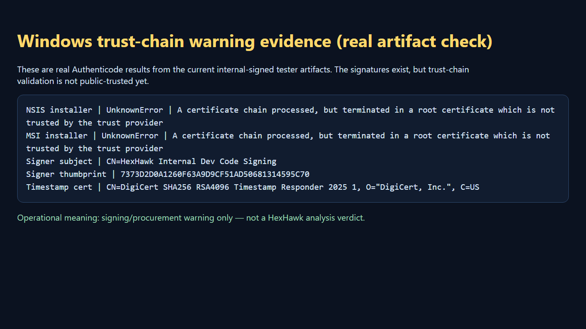

Caption: Signature-status evidence for Windows tester artifacts. For the current exact 1.0.0 candidates, the authoritative status is Authenticode `NotSigned`, with no signer certificate or trusted timestamp; this is not a HexHawk analysis verdict.

## Build locally

From the repository root:

```bash
yarn install
yarn typecheck
yarn build
cargo check --workspace
cargo test --workspace
yarn tauri:build
```

These command names are backed by `package.json`, `HexHawk/package.json`, and `src-tauri/Cargo.toml`. Historical docs report these have passed in a previous validation pass; this publication did not rerun the full build/test suite.

## Launch development mode

```bash
yarn dev
```

or:

```bash
yarn tauri:dev
```

The root `dev` and `tauri:dev` scripts both call the Tauri CLI.


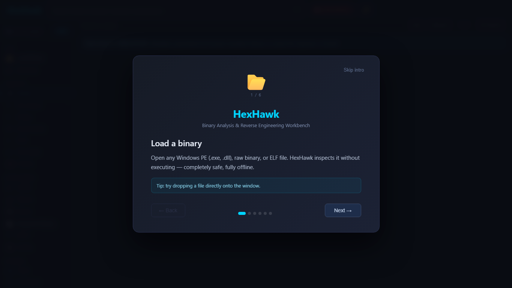

Caption: Captured from browser/dev mode for UI orientation. This shows the first-run HexHawk onboarding screen; it is not native Tauri/WebView2 runtime proof.

## Build installer artifacts

```bash
yarn tauri:build
```

Repository docs describe MSI and NSIS artifacts under:

- `target/release/bundle/msi/HexHawk_1.0.0_x64_en-US.msi`
- `target/release/bundle/nsis/HexHawk_1.0.0_x64-setup.exe`

The verified local release-candidate copies are under `D:/Project/HexHawk/.local/releases/HexHawk-1.0.0-ebbd068-20260714-001856`:

- MSI SHA-256: `A6A298CCFD39F8C53346D23A1BC7EC7795E3251E34031678735BE9C116E09BDB`
- NSIS SHA-256: `9FCC206AA60774F9CFD43E44994967517F8209B842FF266EE047346B5CE3AD61`
- Both: Authenticode `NotSigned`; not installed or acceptance-tested

## Verify native Tauri runtime

A native GUI validation must prove more than “the web page loaded.” Look for runtime proof such as:

- `hasTauriRuntime: true`
- `browserMode: false`
- `window.__TAURI_INTERNALS__` exists

What this means: a Vite/browser simulation can exercise UI components, but it is not the same as a packaged native WebView2 app.


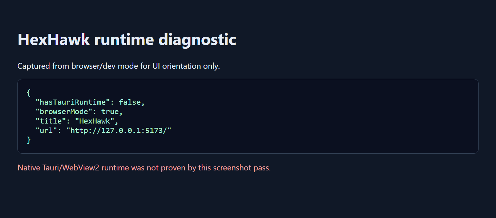

Caption: Captured from browser/dev mode. The diagnostic shows native Tauri/WebView2 was not proven in this screenshot pass; use it as a reminder to separate browser UI orientation from packaged-app proof.

## Trust verification workflow

For the current unsigned 1.0.0 candidates:

1. Record the exact installer filename.
2. Compute SHA-256 locally and compare it with the exact value above.
3. Record Authenticode status as `NotSigned`, with no signer certificate and no trusted timestamp.
4. Use only a controlled non-production test machine under an approved security-exception process.
5. Do not interpret a matching hash as signature, publisher trust, or installed-workflow acceptance.

The following companion-site endpoints describe a future signed-artifact trust channel; their presence does not sign, timestamp, publish, or validate the current candidates:

- `https://hexhawk.ke/trust/keys.json`
- `https://hexhawk.ke/trust/revocations.json`
- `https://hexhawk.ke/trust/signatures/latest/signatures.json`
- `https://hexhawk.ke/trust/signed-timestamps.json`
- `https://hexhawk.ke/trust/key-rotations.json`
- `https://hexhawk.ke/.well-known/hexhawk-trust.json`

For a future signed release, detached-signature, revocation, timestamp, discovery, and key-rotation checks must be performed against the exact published artifact and separately validated release metadata. Updater readiness must not be inferred from configuration or endpoint presence.

---

# Part 3: The Beginner's First Analysis

## Choose a safe sample

Use only files you are authorized to analyze. For first practice, use a known challenge file, a toy executable, or an internal test fixture. Avoid live unknown malware until your environment and handling procedures are ready.

## GUI path: first analysis

1. Launch HexHawk.
2. Use Load/Open/Browse to choose a file.
3. Go to Metadata and run Inspect.
4. Go to Strings and scan strings.
5. Go to Disassembly and analyze a selected range.
6. Go to CFG if you have a useful code range.
7. Review Binary Verdict / Threat Assessment where available.
8. Use NEST if you have Enterprise-tier access and need evidence convergence.
9. Use Report to package the current analysis.

Expected outputs:

- file type and architecture
- hashes
- sections/imports/exports where parseable
- strings
- disassembly instructions
- CFG nodes/edges for selected ranges
- report JSON/Markdown-like output depending on UI path
- Function Intelligence JSON/Markdown export for the selected function

What not to conclude: one suspicious import, one string, or one decompiler phrase is not enough to claim malware.


Visual walkthrough:

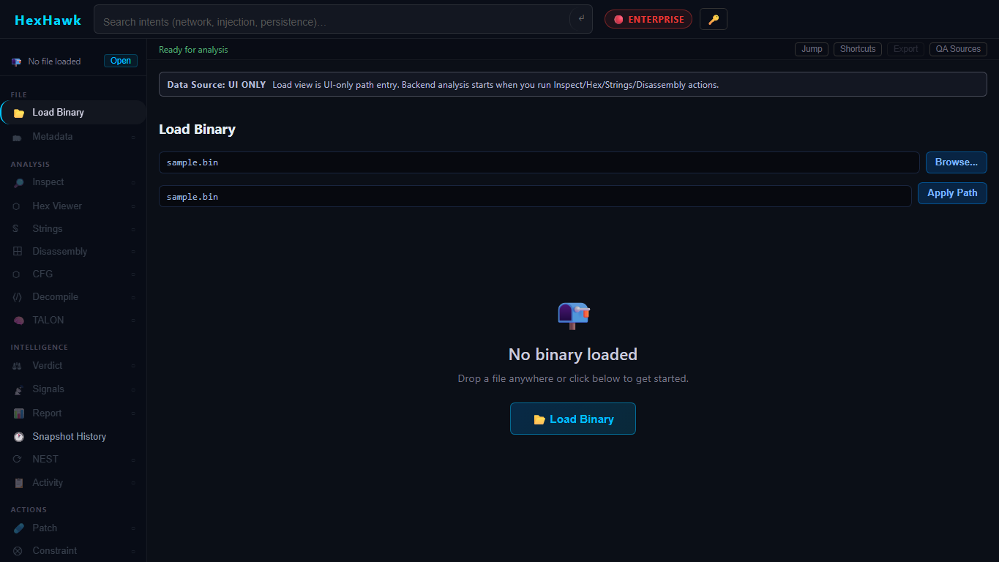

Caption: Captured from browser/dev mode. This shows the Load Binary panel before applying the authorized sample path used for this documentation pass.

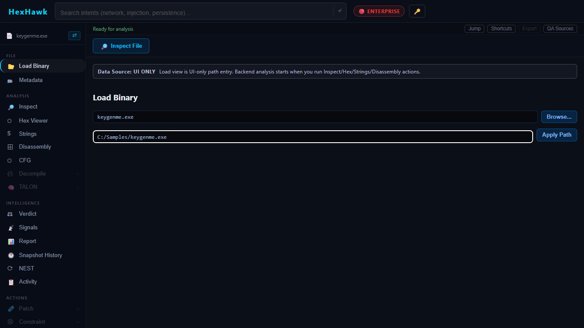

Caption: Captured from browser/dev mode with `Challenges/ch76/keygenme.exe` entered as the safe sample. This is a visual orientation aid only; authoritative verdict provenance still comes from GYRE-linked output and exported authority metadata.

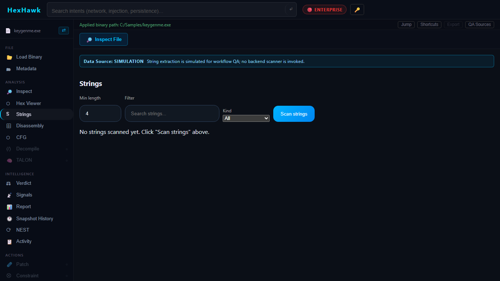

Caption: Captured from browser/dev mode after applying the safe sample path. Strings are evidence to review; one string by itself is not enough to claim malware.

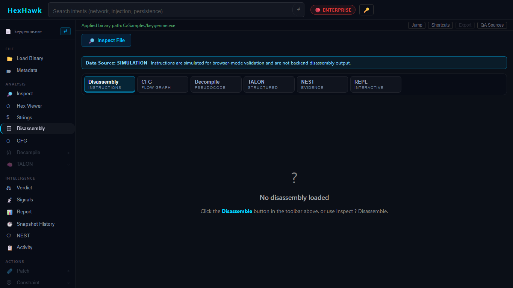

Caption: Captured from browser/dev mode. The disassembly workspace is a visual analysis surface; it does not change GYRE verdict authority.

## CLI path: first analysis

If `nest_cli.exe` is built:

```bash
target/release/nest_cli.exe identify <path-to-file>
target/release/nest_cli.exe inspect <path-to-file>
target/release/nest_cli.exe strings <path-to-file>
target/release/nest_cli.exe disassemble <path-to-file> <offset> <length>
target/release/nest_cli.exe cfg <path-to-file> <offset> <length>
```

Example captured during this publication:

```json
{"format":"PE/MZ","magic_hex":"4D 5A 90 00","file_size":2804697,"entropy_header_4kb":4.617667586433138}
```

That output came from:

```bash
./target/release/nest_cli.exe identify Challenges/ch76/keygenme.exe
```

---

# Part 4: Understanding HexHawk Evidence

## File identity

File identity is the starting point. HexHawk metadata includes size and hashes such as SHA256, SHA1, and MD5. NEST evidence bundles rely on stable file identity so exported evidence stays tied to the bytes that were analyzed.

## Metadata

Metadata includes file type, architecture, entry point, image base, sections, imports, exports, symbol counts, and hashes where available.

What this means: metadata tells you what kind of object you are looking at.

What not to assume: file type does not equal intent.

## Strings

Strings are printable byte sequences found in a file. They can reveal paths, URLs, error messages, compiler names, API names, or decoys.

What not to assume: a string can be dead data, packed data, copied library text, or a lure.

## Disassembly

Disassembly turns bytes into assembly instructions for a selected range. HexHawk exposes range-bound disassembly through both GUI and CLI.

What not to assume: a small disassembled range represents the whole program.

## Control-flow graphs

CFGs show basic blocks and edges for a selected code region. They help beginners see branching and loops.

## Signatures and ECHO

Signature matching and ECHO-style correlation help find known patterns, crypto/obfuscation shapes, or fuzzy similarities. Treat matches as evidence, not final truth.

## TALON decompiler evidence

TALON and decompiler views help translate low-level code into more readable forms. Optional LLM narration may explain the result, but the underlying decompiler output and original bytes remain primary. Current source work also cleans raw IR artefacts from pseudocode output.

## Function Notebook evidence

Function Notebook is a selected-function evidence view. It brings together imports, callers, callees, xrefs, recovered boundaries, Win32 constants, pseudocode, calling-convention hints, debugger observations, conditional breakpoint hits, and known analysis limits. It can export Function Intelligence JSON or Markdown. This is advisory evidence only; it is not a malware verdict and does not replace GYRE.

## STRIKE/runtime evidence

STRIKE and debugger panels provide runtime/debugger-oriented evidence for authorized workflows. This is not a blanket malware detonation claim.

## Exploitability-adjacent evidence

HexHawk contains patch, CFG, unsafe-pattern, mitigation, and advisory analysis surfaces in the codebase. Treat these as analyst aids unless a specific report/export explicitly validates a stronger claim.

## Confidence and unknowns

Confidence is not certainty. Unknown means HexHawk did not have enough stable evidence to classify with confidence; it does not mean the file is harmless.

---

# Part 5: GYRE Verdicts for Dummies

GYRE is the only layer allowed to own classification and base confidence.

## Classification vs confidence

Classification is the label. Confidence is how strongly the evidence supports the label. A label with low confidence should be treated carefully.


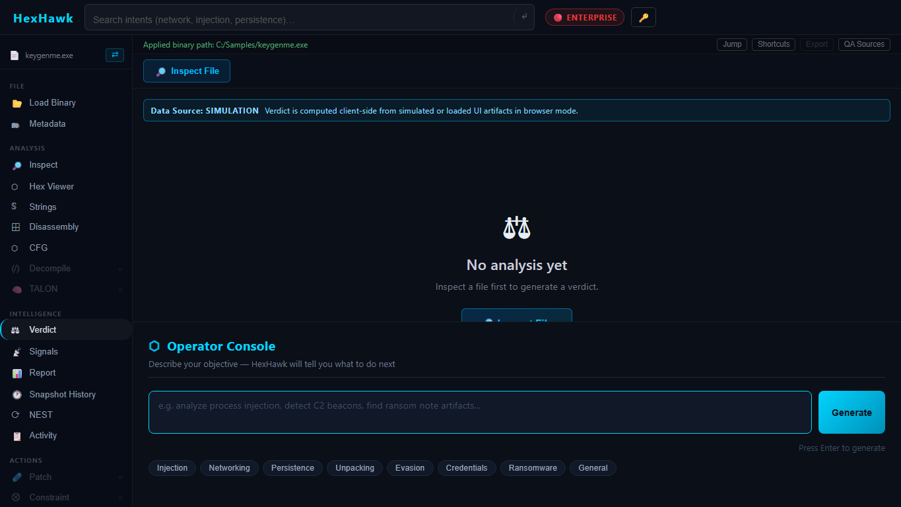

Caption: Captured from browser/dev mode. This is the visible Verdict panel state for orientation; GYRE remains the sole verdict authority and the UI is only presenting engine-linked output when available.

## How to read GYRE-linked outputs

Look for:

- `source_engine: gyre`
- base confidence
- final verdict snapshot
- `gyre_is_sole_verdict_source: true`

## How to verify GYRE authority

In reports or NEST exports, confirm:

- GYRE remains named as source engine.
- NEST is described as enrichment/orchestration.
- AETHERFRAME/Forge metadata does not alter classification.
- AI content is marked advisory.

---

# Part 6: NEST Evidence Convergence for Dummies

NEST is the evidence organizer. It can create a session, append iterations, finalize a session, verify binary identity, summarize, and export evidence bundles through backend commands.

## What NEST does

- Keeps evidence file-bound.
- Tracks iterations and deltas.
- Links final snapshots back to GYRE.
- Supports replay/audit semantics in the evidence schema.

## What NEST does not do

NEST does not become a verdict engine. It may select and package GYRE-linked evidence, but it must not replace GYRE.


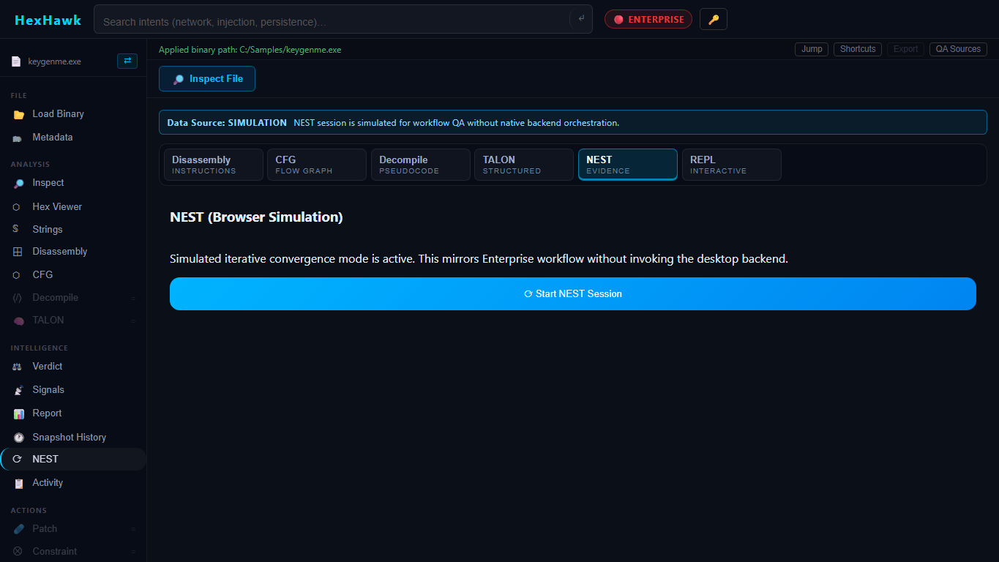

Caption: Captured from browser/dev mode showing the NEST browser simulation state. NEST organizes and converges evidence; it does not replace GYRE as verdict authority.

## Evidence bundle basics

The design/spec examples describe files such as:

- `manifest.json`
- `binary_identity.json`
- `session.json`
- `iterations.json`
- `deltas.json`
- `final_verdict_snapshot.json`
- `runtime_proof.json` when required
- `audit_refs.json`
- optional `review_summary.md`

Important: the schema spec still contains a design-status line, while current source includes lifecycle commands and tests. Treat NEST bundle details as contract-backed but release-validation-sensitive.

## Common failure states

- missing file identity
- mismatched SHA256
- missing GYRE source marker
- missing runtime proof when runtime proof is claimed
- report export that contains authority metadata but not a typed NEST evidence bundle

---

# Part 7: AETHERFRAME/Forge for Dummies

AETHERFRAME/Forge is optional bounded uplift/refinement/lineage metadata.

## Plain-English version

AETHERFRAME can help explain or refine confidence metadata under policy. It is not allowed to change what GYRE classified.

## Base vs promoted confidence

- Base confidence: the confidence recorded by the authoritative GYRE snapshot before any optional advisory metadata.
- Promoted confidence: optional policy-gated confidence metadata after uplift.
- Confidence delta: the difference.
- Uplift applied: whether the optional path was used.

## High-assurance mode

High-assurance workflows need deterministic outputs and a way to disable uplift. Reports must disclose whether uplift/lineage metadata was applied.


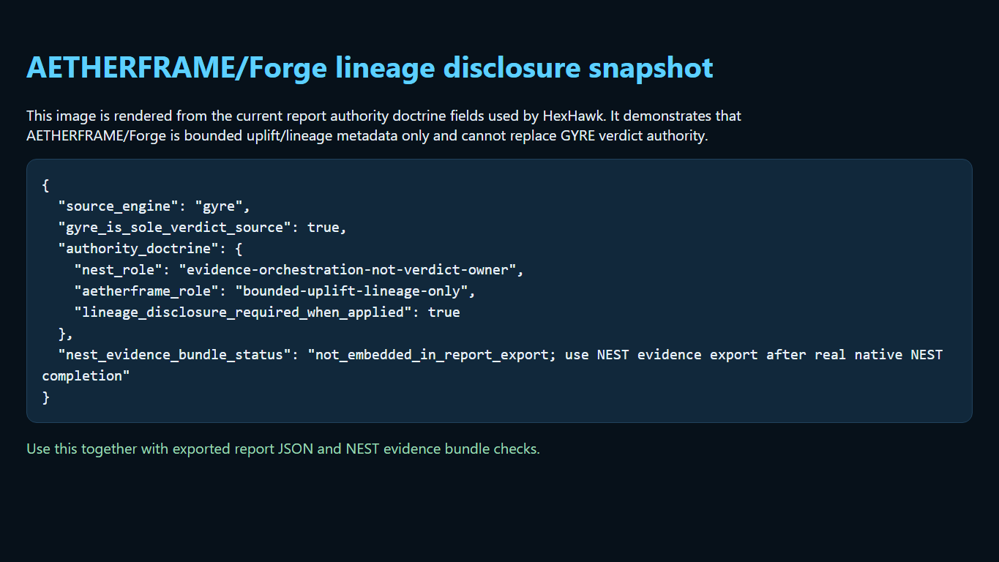

Caption: Rendered from current report authority doctrine fields to show the exact lineage/uplift disclosure contract. AETHERFRAME/Forge are optional and non-authoritative; they must not change GYRE classification.

---

# Part 8: Reports and CREST

Reports are for packaging evidence so another analyst can understand what was examined, what was found, and what remains uncertain.


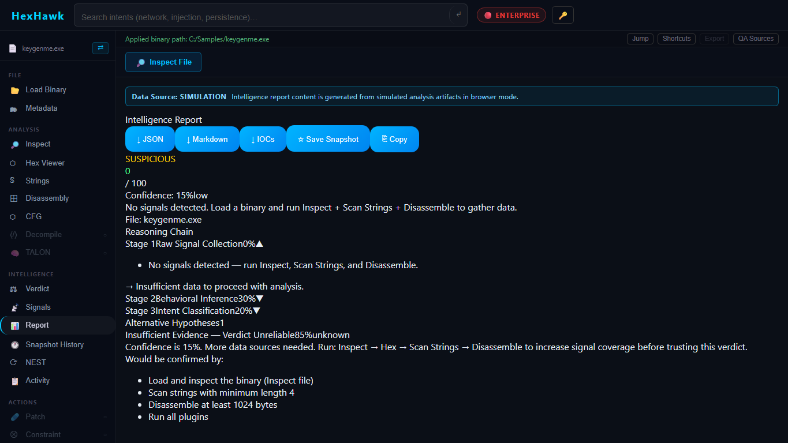

Caption: Captured from browser/dev mode. The report panel packages evidence for review; it does not create a new verdict authority.

## What a good report should include

- file identity
- hashes
- metadata
- strings and important signals
- disassembly/CFG references where relevant
- GYRE-linked verdict snapshot
- NEST session/bundle status if used
- AETHERFRAME/Forge disclosure if used
- limitations and unproven areas

## Authority fields to look for

```json
{
  "source_engine": "gyre",
  "gyre_is_sole_verdict_source": true
}
```

What not to assume: a general intelligence report is not automatically the same as a typed NEST evidence bundle.


Caption: Captured from browser/dev mode as the report/authority area visible in this pass. Export parity and typed NEST evidence bundle contents were not validated; for high-assurance review, inspect exported fields directly.

---

# Part 9: CLI Workflows

## `nest_cli identify`

Purpose: quick format identification.

Syntax:

```bash
nest_cli identify <path>
```

Output: JSON with `format`, `magic_hex`, `file_size`, and `entropy_header_4kb`.


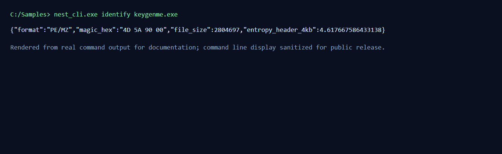

Caption: Rendered from real `nest_cli identify Challenges/ch76/keygenme.exe` command output for documentation. It is not an OS terminal-window capture, and the copyable command/output block remains the accessible source.

## `nest_cli inspect`

Purpose: metadata extraction.

Syntax:

```bash
nest_cli inspect <path>
```

Output: JSON metadata including file type, architecture, sections, imports, exports, and hashes.

## `nest_cli strings`

Purpose: extract printable strings.

Syntax:

```bash
nest_cli strings <path>
```

Output: JSON strings result.

## `nest_cli disassemble`

Purpose: disassemble a file range.

Syntax:

```bash
nest_cli disassemble <path> <offset> <length>
```

Offsets and lengths are decimal numbers.

## `nest_cli cfg`

Purpose: build a CFG for a range.

Syntax:

```bash
nest_cli cfg <path> <offset> <length>
```

## `nest_cli serve --mcp`

Purpose: expose HexHawk operations over newline-delimited JSON-RPC/MCP.

Syntax:

```bash
nest_cli serve --mcp
```

Tools listed by the source include inspect, disassemble, strings, build_cfg, a live-session NEST results stub, agent signal proposal, and patch proposal. Agent signals and patch proposals are approval-gated; do not treat them as autonomous mutation.

---

# Part 10: GUI Workflows

## Main panels discovered in source

The app includes tabs/panels for metadata, hex, strings, CFG, plugins, disassembly, bookmarks, logs, graph, report, decompile, debugger, signatures, TALON, document, sandbox, constraint, STRIKE, ECHO, NEST, console, diff, REPL, and agent.

## Workspace tabs and scrollable panes

Complex tool views now use a bounded workspace pattern instead of one long page. The source-backed workspace tab bar groups Disassembly, CFG, Decompile, TALON, NEST, and REPL so analysts can pivot between related reverse-engineering tools without losing the viewport. The Disassembly workspace has internal tabs for:

- Instructions: the virtualized instruction list plus overview analysis.
- Patches: queued branch/NOP patch proposals and patch suggestions.
- XRefs: references for the currently selected address.
- Patterns: suspicious pattern categories and related analysis.

These tabs are UI organization only. They do not add new analysis authority, do not change GYRE classification, and do not make NEST/AETHERFRAME/AI authoritative.


Caption: Captured from browser/dev mode. The workspace and navigation are orientation surfaces; they do not alter the GYRE/NEST/AETHERFRAME authority boundaries.

## Beginner GUI flow

1. Load file.
2. Inspect metadata.
3. Scan strings.
4. Disassemble a range.
5. Build CFG if needed.
6. Run plugins if needed.
7. Use signature/ECHO/TALON/STRIKE panels as appropriate.
8. Use NEST to converge and package evidence if available.
9. Export/report through CREST report panel.

## Gated states

Tier config gates features:

- Free: metadata, hex, strings, CFG, plugins, disassembly, basic decompile.
- Pro: TALON, constraints, sandbox, document analysis, debugger, STRIKE, signatures, ECHO, bookmarks/logs/graph/report/console/diff/agent.
- Enterprise: NEST.

This is a product gate, not a truth hierarchy.


Caption: Captured from browser/dev mode showing the NEST simulation state used for orientation. Feature gating and simulation states are product/runtime conditions, not an authority hierarchy and not a replacement for GYRE.

---

# Part 11: Configuration

## Tauri configuration

File: `src-tauri/tauri.conf.json`

Key settings:

- product name: HexHawk
- version: 1.0.0
- identifier: `com.hexhawk.app`
- dev URL: `http://localhost:5173`
- frontend dist: `../HexHawk/dist`
- bundle targets: all
- Windows WebView install mode: embedded bootstrapper, silent
- updater artifacts: disabled for local unsigned builds by `createUpdaterArtifacts: false`
- signing command: not configured in `tauri.conf.json` for local unsigned builds; use a real release signing step/script before claiming signed artifacts
- updater pubkey: configured
- updater endpoint: `https://hexhawk.ke/releases/latest.json`

## Tier and license configuration

File: `HexHawk/src/utils/tierConfig.ts`

Important values:

- tiers: free, pro, enterprise
- free file size warning limit: 50 MB
- free console query limit: 5 per session
- tier stored in localStorage key `hexhawk.tier`
- license key stored in localStorage key `hexhawk.license_key`

Backend license verification lives in `src-tauri/src/commands/license.rs`. Trial builds use the Cargo feature `trial` and store a `trial_install.dat` file in app data.

Security note: do not put production secrets in docs or source examples.

## BYOK AI configuration

Files: `src-tauri/src/commands/llm.rs`, `docs/m10_ai_backbone.md`, `docs/m11_byok_ai.md`

Supported providers in source/docs:

- OpenAI
- Anthropic
- Ollama

Important controls:

- explicit approval required per request
- remote endpoints blocked unless allowed
- max prompt/context/token/timeout limits
- Stronghold-backed key storage
- advisory-only response contract

## Build-time configuration

File: `src-tauri/Cargo.toml`

Important feature:

- `trial = []`

## Plugin configuration

User plugins are managed through backend commands that return/open the plugin directory. Allowed extensions are platform-specific: `.dll` on Windows, `.dylib` on macOS, `.so` on Linux.

---

# Part 12: Plugins and Extensions

HexHawk has a real plugin extension surface.

## Plugin API

File: `plugin-api/src/lib.rs`

A plugin returns a `PluginResult` with:

- schema version
- plugin name
- version
- success boolean
- summary
- optional JSON details
- kind: metric, analysis, strings, warning, or error
- optional plugin hash

The C ABI entry symbol is `hexhawk_plugin_entry`.

## Sample plugin

File: `plugins/byte_counter/src/lib.rs`

The ByteCounter sample reports the number of bytes in the loaded sample.

## Plugin safety limits

From backend source:

- installed plugin binary max: 64 MB
- analyzed input file max for plugin run: 512 MB
- plugin execution timeout: 3 seconds
- max inflight plugin workers: 8
- result JSON max: 5 MB

## What plugins may do

Plugins can produce evidence or metrics from file bytes.

## What plugins must not be treated as

A plugin is not the verdict authority. If a plugin says something is suspicious, that is evidence to review, not a replacement for GYRE.

---

# Part 13: Reverse Engineering Recipes

## Recipe: identify what kind of file this is

Goal: determine file type and basic header evidence.

CLI:

```bash
nest_cli identify sample.exe
nest_cli inspect sample.exe
```

GUI:

1. Load file.
2. Open Metadata.
3. Inspect.

Interpretation: use file type, architecture, sections, and hashes as starting facts.

## Recipe: extract useful strings

CLI:

```bash
nest_cli strings sample.exe
```

GUI:

1. Load file.
2. Open Strings.
3. Scan strings.

What not to conclude: a URL or API name is a lead, not final proof.

## Recipe: inspect sections and imports

Use metadata inspection. Look for unusual section permissions, high entropy, packed-looking section names, and suspicious imports. Keep notes, but avoid jumping from one fact to a final conclusion.

## Recipe: generate disassembly

CLI:

```bash
nest_cli disassemble sample.exe 4096 512
```

GUI: use the Disassembly panel after loading a file.

Tip: start with entry point or `.text` offsets from metadata.

## Recipe: build a CFG

CLI:

```bash
nest_cli cfg sample.exe 4096 512
```

GUI: use CFG panel for a selected range.

## Recipe: generate a report

1. Load and inspect file.
2. Run strings/disassembly/CFG/signature/plugin workflows as needed.
3. Review GYRE-linked verdict surface.
4. Use Report/CREST panel.
5. Check for GYRE authority markers.
6. Include limitations in the report.

## Recipe: run high-assurance no-uplift review

1. Use deterministic local evidence first.
2. Disable or avoid optional AI/uplift paths where policy requires.
3. Export/report only with clear authority metadata.
4. Verify `source_engine: gyre` and `gyre_is_sole_verdict_source: true`.
5. Record unproven paths.

## Recipe: install and test a plugin

1. Build plugin using the plugin API.
2. Ensure output extension matches platform.
3. In HexHawk, open Plugins/Quill panel.
4. Install plugin.
5. Run plugins on a sample.
6. Confirm result JSON is evidence-only.

## Recipe: import/use a trace or debugger path

Use STRIKE/debugger panels only for authorized programs and only in environments designed for runtime investigation. Treat debugger outputs as evidence, not detonation proof.

---

# Part 14: Recompiling and Development Workflows

## Install dependencies

```bash
yarn install
```

## Frontend tests

```bash
yarn test --reporter=dot
```

## Typecheck and production build

```bash
yarn typecheck
yarn build
```

## Rust validation

```bash
cargo check --workspace
cargo test --workspace
```

## Tauri build

```bash
yarn tauri:build
```

## MSI administrative extraction

```bash
msiexec.exe /a HexHawk_1.0.0_x64_en-US.msi /qn TARGETDIR=<extract-dir>
```

## Extracted CLI smoke

```bash
nest_cli.exe identify D:/Project/HexHawk/Challenges/ch76/keygenme.exe
```

## Do not confuse historical proof with current proof

If you change code, rebuild. If you change packaging, rerun extraction and native GUI validation. If you change reports, rerun export parity checks.

---

# Part 15: High-Assurance Operation

High assurance means deterministic evidence, explicit policy gates, replayable exports, and honest limitations.

## Checklist

- GYRE remains source engine.
- NEST bundle preserves binary identity.
- AETHERFRAME/Forge uplift is disabled or explicitly disclosed.
- AI output is advisory or not used.
- Export includes authority markers.
- Evidence validation does not default silently to success.
- Native runtime proof is captured if native fidelity is claimed.
- Final artifact was actually tested.

## Before external high-assurance testers

The build is not yet an external high-assurance release. Required gates include controlled installation and launch, installed two-binary persistence/reopen, restart/cache-clear recovery, installed report/export provenance, uninstall/reinstall and user-data-retention acceptance, signing, and exact signed-artifact updater validation.

---

# Part 16: Troubleshooting

## App will not launch

Symptom: no window or immediate close.
Likely cause: missing runtime dependency, build failure, WebView2 issue, or stale artifact.
Diagnose: run from terminal in dev mode, inspect console/logs, confirm WebView2.
Fix: rebuild, install WebView2, or use current MSI/NSIS artifact.
Escalate: if packaged app fails but dev app works.

## Windows trust warning

Symptom: Windows warns about unknown publisher.
Likely cause: the current local artifacts are unsigned, or a future signed build uses a chain not trusted by that host policy.
Fix: for internal testing, document and approve exception policy; for external release, use organization/public-trusted signing chain and rerun release validation.

## CLI not found

Symptom: `nest_cli` command missing.
Diagnose: check `target/release/nest_cli.exe` or build with Cargo/Tauri.
Fix: run `cargo build --release --bin nest_cli` or `yarn tauri:build`.

## Binary fails to open

Likely cause: path issue, permission issue, file too large, unsupported format, or browser simulation.
Fix: use a local path, verify permissions, try CLI identify/inspect.

## Analysis returns unknown

Likely cause: insufficient evidence, unsupported format, packed/obfuscated content, or limited analysis range.
Fix: gather more evidence; inspect strings, metadata, disassembly, signatures, and plugins.

## NEST validation fails

Likely cause: mismatched identity, missing required file, missing GYRE authority marker, stale runtime proof.
Fix: rerun session/export against exact file and inspect bundle fields.

## Export missing authority fields

Fix: do not patch around the missing fields manually. Reproduce from the report/export path and repair source if needed.

## Browser simulation mistaken for native runtime

Diagnose: check `hasTauriRuntime`, `browserMode`, and `window.__TAURI_INTERNALS__`.
Fix: rerun in packaged/native Tauri app.


Caption: Captured from browser/dev mode. It explicitly shows native Tauri/WebView2 was not proven, so do not use this screenshot as packaged-app proof.

## Build fails

Use the narrow error first:

- Yarn failure: reinstall deps, check workspace scripts.
- TypeScript failure: run `yarn typecheck`.
- Rust failure: run `cargo check --workspace`.
- Tauri failure: inspect `src-tauri/tauri.conf.json` and backend compile output.

## AETHERFRAME/uplift unexpectedly active

Check report metadata, UI policy state, and high-assurance settings. In high-assurance mode, require base GYRE/NEST outputs and clear uplift disclosure.

## License or trial issue

Check build info, license panel, `trial` feature behavior, and localStorage tier/license values. Do not publish license secrets in support logs.

---

# Part 17: Job Cookbook

## Job: analyze a suspicious binary and produce a shareable report

Skill level: beginner/intermediate.
Time: 15-60 minutes.

Steps:
1. Confirm authorization.
2. Load file.
3. Inspect metadata and hashes.
4. Extract strings.
5. Disassemble entry/risky ranges.
6. Run signatures/plugins if useful.
7. Review GYRE-linked verdict surface.
8. Use NEST if available and needed.
9. Export report.
10. Verify authority markers and limitations.

Success: report includes identity, evidence, GYRE authority, and limitations.
Failure: report lacks file identity or authority metadata.

## Job: run a high-assurance no-uplift analysis

Steps:
1. Use local evidence only.
2. Avoid remote AI calls.
3. Disable or avoid uplift paths.
4. Run metadata/strings/disassembly/CFG.
5. Export report.
6. Verify no promoted confidence changed classification.

## Job: compare evidence between two binaries

Use Binary Diff panel or run metadata/disassembly/CFG on both files. Compare hashes, sections, imports, strings, and selected code ranges. State differences as observations.

## Job: validate GYRE is the sole verdict source in an export

Look for:

- `source_engine: gyre`
- `gyre_is_sole_verdict_source: true`
- NEST role described as enrichment/orchestration
- AI content marked advisory

## Job: build HexHawk locally

Run:

```bash
yarn install
yarn typecheck
yarn build
cargo check --workspace
cargo test --workspace
yarn tauri:build
```

Success: commands complete and artifacts exist. Still not an external release without signing and artifact validation.

## Job: smoke-test `nest_cli`

```bash
target/release/nest_cli.exe identify Challenges/ch76/keygenme.exe
target/release/nest_cli.exe inspect Challenges/ch76/keygenme.exe
```

Success: JSON output appears and command exit code is zero.

## Job: test a plugin

1. Build a plugin against `plugin-api`.
2. Install it through the plugin panel.
3. Run plugins on a small sample.
4. Confirm result is bounded and evidence-only.

---

# Part 18: Glossary

Binary: a file made of bytes, often an executable or library.
PE: Windows Portable Executable format.
ELF: common Linux executable/library format.
Mach-O: Apple executable/library format.
Static analysis: examining bytes without running the program.
Dynamic analysis: observing runtime behavior under controlled conditions.
Disassembly: converting machine code bytes into assembly instructions.
Decompilation: producing higher-level pseudocode from lower-level code.
CFG: control-flow graph showing basic blocks and branches.
Import: external function/library a binary asks for.
Export: function/symbol a binary provides to others.
Section: named file/code/data region in a binary.
String: printable text found in bytes.
Signature: pattern used to match known code/data shapes.
Verdict: classification output owned by GYRE.
Confidence: strength of evidence behind a label.
Evidence bundle: structured package of evidence and identity metadata.
Uplift: optional confidence metadata adjustment, not classification change.
Lineage: metadata explaining where a refinement/uplift came from.
High-assurance mode: deterministic, auditable, replayable workflow with optional uplift disabled or disclosed.
Replayability: ability to rerun or audit evidence against the same bytes/config.
Tauri: desktop framework used by HexHawk.
WebView2: Microsoft web runtime used by Tauri on Windows.
MSI: Windows installer package.
NSIS: Windows installer system/installer artifact type.
GYRE: sole verdict authority.
NEST: evidence convergence/orchestration layer.
AETHERFRAME: optional bounded uplift/refinement/lineage layer.
Forge: AETHERFRAME lineage/uplift metadata surface.
TALON: decompiler/structured pseudocode evidence surface.
STRIKE: debugger/runtime intelligence evidence surface.
ECHO: signature/correlation evidence surface.
CREST: report packaging/export surface.
NEXUS: assistant/consumer layer, not verdict authority.

---

# Part 19: Capability Matrix

| Capability | GUI | CLI | Configurable | Plugin/extension | Report/export | Tests/evidence | Maturity |
| --- | --- | --- | --- | --- | --- | --- | --- |
| File load/open | Yes | Path input to CLI | No | No | Indirect | Source/selectors | Supported |
| Identify format | Indirect via metadata | Yes | No | No | Evidence | Smoke run | Supported |
| Metadata/hashes | Yes | Yes | No | No | Yes | Source/tests | Supported |
| Strings | Yes | Yes | Range/min length in MCP paths | No | Yes | Source | Supported |
| Disassembly | Yes | Yes | Range inputs | No | Yes | Source/tests | Supported |
| CFG | Yes | Yes | Range inputs | No | Yes | Source/tests | Supported |
| GYRE verdict surface | Yes | Not direct standalone CLI | Policy/docs | No | Yes | Source/tests/docs | Supported with boundaries |
| NEST sessions | Yes | MCP live-session stub only | Policy/docs | No | Yes | Source/tests/docs | Enterprise/internal |
| CREST report | Yes | No standalone CLI found | UI state | No | Yes | Component/tests | Supported, parity-sensitive |
| TALON/decompile | Yes | No direct CLI found | BYOK optional | No | Report context | Tests/docs | Supported with caveats |
| STRIKE/debugger | Yes | No direct CLI found | OS/runtime | No | Evidence | Source/tests | Environment-sensitive |
| ECHO/signatures | Yes | No direct CLI found | Signature files | No | Evidence | Tests/source | Supported/pro |
| Plugins | Yes | Not standalone CLI | Plugin dir/platform ext | Yes | Evidence/results | Source/tests/sample | Implemented |
| MCP server | No GUI required | Yes | JSON-RPC client | Integration | No direct report | Source | Experimental/integration |
| AI/BYOK | Yes | Backend commands via Tauri | Provider/key/policy | Provider abstraction | Advisory text | Docs/tests | Supported with approval |
| License/tier | Yes | Backend command | Tier/localStorage/build feature | No | No | Source | Implemented |
| Build/package | No | Developer shell | Tauri/Cargo/package configs | N/A | Artifacts | Historical docs | Internal tester |

---

# Part 20: Appendix

## Command reference

```bash
yarn install
yarn dev
yarn typecheck
yarn build
yarn test --reporter=dot
yarn tauri:build
cargo check --workspace
cargo test --workspace
cargo build --release --bin nest_cli
nest_cli identify <path>
nest_cli inspect <path>
nest_cli strings <path>
nest_cli disassemble <path> <offset> <length>
nest_cli cfg <path> <offset> <length>
nest_cli serve --mcp
```

## Important file locations

- `README.md`
- `ROADMAP.md`
- `src-tauri/tauri.conf.json`
- `src-tauri/src/main.rs`
- `src-tauri/src/bin/nest_cli.rs`
- `src-tauri/src/commands/`
- `HexHawk/src/App.tsx`
- `HexHawk/src/components/`
- `HexHawk/src/utils/`
- `plugin-api/src/lib.rs`
- `plugins/byte_counter/src/lib.rs`
- `docs/ENGINE_BOUNDARY_DOCTRINE.md`
- `docs/HIGH_ASSURANCE_GUIDE.md`
- `docs/nest_evidence_schema_spec.md`

## Safe-use checklist

- I am authorized to analyze this file.
- I know whether I am in browser simulation or native Tauri runtime.
- I preserved file identity and hashes.
- I separated evidence from conclusions.
- I checked GYRE authority markers.
- I disclosed NEST/AETHERFRAME/AI status.
- I recorded limitations.
- I did not include secrets in reports.

## Publication evidence bibliography

See `docs/HEXHAWK_FOR_DUMMIES_SOURCE_MAP.md` for claim-to-source references.

---

## Printable Trust Verification Checklist (One Page)

Print and check each box during release verification.

Artifact under review: ______________________________

Version: ______________________________

Date/Time (UTC): ______________________________

Operator: ______________________________

### Integrity

- [ ] SHA-256 computed locally.
- [ ] SHA-256 matches published checksum.
- [ ] Checksum source recorded (`/downloads/checksums.txt` or release checksum file).

### Signature

- [ ] Authenticode status recorded for the exact artifact.
- [ ] For the current 1.0.0 candidate, result recorded as `NotSigned` with no signer certificate and no trusted timestamp.
- [ ] No matching-hash result is described as a signature or publisher-trust result.
- [ ] For a future signed release only, signer identity, certificate chain, signature algorithm, and exact-artifact signature result are recorded.

### Revocation and timestamp

- [ ] Current unsigned candidate recorded as having no signer key and no trusted timestamp.
- [ ] For a future signed release only, signer/key revocation status is checked against release evidence.
- [ ] For a future signed release only, trusted timestamp validation is recorded for the exact artifact.

### Discovery and rotation

- [ ] Endpoint/configuration presence is not treated as updater or signing readiness.
- [ ] For a future signed release only, discovery and key-rotation evidence is checked against the exact published release.

### Runtime and workflow proof

- [ ] If claiming native proof, runtime evidence shows `hasTauriRuntime: true` and `browserMode: false`.
- [ ] If reporting browser/dev screenshots, labeled as orientation only.
- [ ] Export/report includes authority markers (`source_engine: gyre`, `gyre_is_sole_verdict_source: true`).

### Final release decision

- [ ] Trust verdict: ACCEPT / CONDITIONAL / REJECT.
- [ ] Exceptions documented (for example: controlled testing of an Authenticode `NotSigned` candidate).
- [ ] Reviewer sign-off captured.

---

# Part 21: Buyer / Evaluator FAQ

## Is HexHawk a replacement for IDA Pro, Ghidra, Binary Ninja, Cutter, or x64dbg?

Not as a universal decompiler/debugger replacement today. Those tools are mature reverse-engineering suites with deep ecosystems. HexHawk's sharper wedge is evidence-to-report continuity: local file facts, function evidence, labelled helper output, GYRE verdict authority, NEST evidence grouping, and CREST handoff packages.

## Is HexHawk a malware sandbox?

No. STRIKE can organize approved runtime/debugger observations, but HexHawk should not be described as a cloud detonation sandbox or as something that automatically executes malware for you.

## What should a new tester do first?

Use a known safe sample on a controlled machine, record hashes, inspect file facts, review strings/imports/functions, check GYRE and NEST labels, export a report, and write down what remains unknown.

## What does a good HexHawk output look like?

A good output says: this was the input file; these are the hashes and identity facts; these observations came from static analysis, function evidence, runtime notes, signatures, or analyst notes; GYRE owns the verdict; NEST organized supporting evidence; AETHERFRAME/NEXUS comments are advisory; these limits remain.

## What should sales or docs never imply?

Do not imply one-click safety, public-release readiness, automatic updater readiness, procurement-ready signing, sandbox detonation, exploit proof, or AI-owned classification unless exact current evidence proves it.

## What makes the guide complete enough to publish?

It is complete enough when a stranger can answer these questions without internal tribal knowledge: what HexHawk does, who it is for, what file/input it needs, what output it produces, which module decides what, how to verify a package, what remains gated, and when another tool category may be a better fit.
